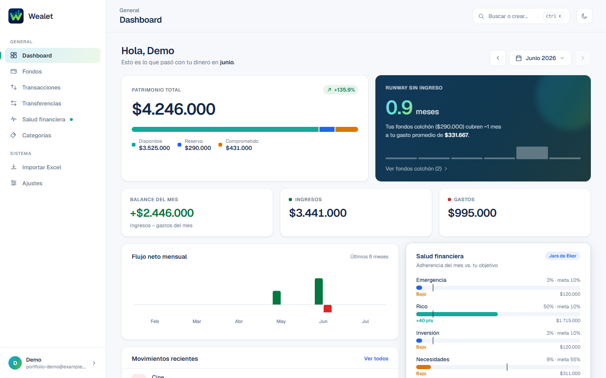
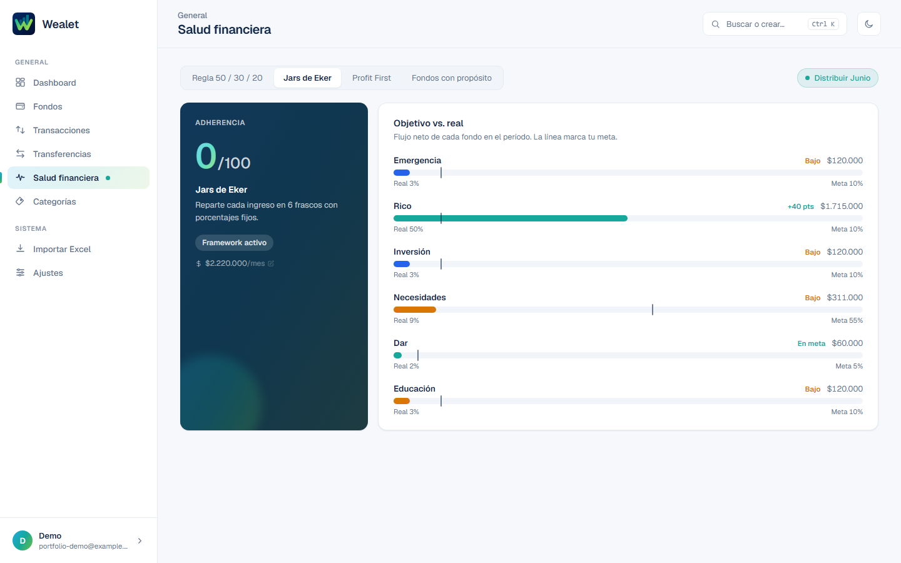
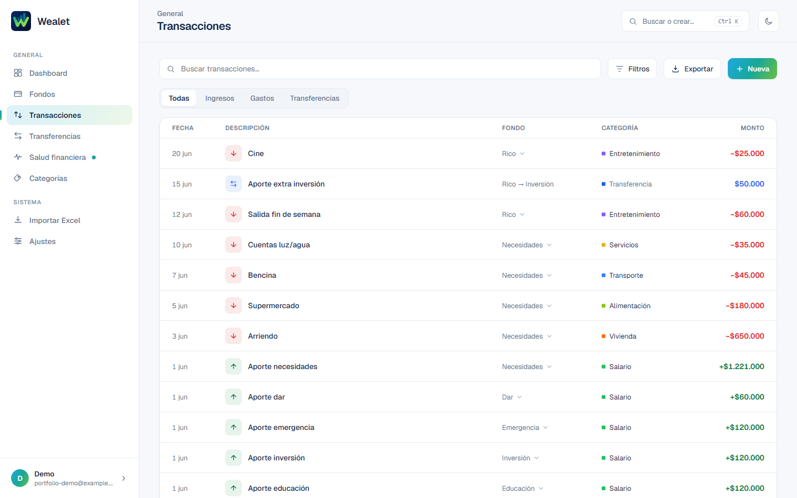

<div align="center">

# Wealet

Aplicación de finanzas personales basada en un sistema de fondos (envelope budgeting).
Full-stack, construida como proyecto de portafolio.

[](https://github.com/ISeco/wealet/actions/workflows/ci.yml)


**[Ver demo en vivo →](https://wealet-web.vercel.app/)**

</div>

> El demo corre en planes gratuitos (Vercel + Render): la primera carga puede tardar
> ~30-60s en despertar el backend tras un período de inactividad.

## Qué es

Wealet organiza el dinero en **fondos** (envelopes) en vez de categorías de gasto planas:
cada peso vive en un fondo con un propósito (gastos fijos, ahorro, inversión, etc.), y la
app mide qué tan bien se está cumpliendo ese plan mes a mes.

- **Distribución del ingreso mensual** en fondos, con presets de frameworks conocidos
  (Regla 50/30/20, Jars de Eker, Profit First) o fondos propios.
- **Salud financiera**: adherencia real vs. objetivo por fondo, framework activo configurable.
- **Transferencias atómicas** entre fondos, transacciones con categorías, y un timeline
  unificado de actividad.
- **Reportes**: patrimonio total, runway sin ingreso, flujo neto mensual, gasto por categoría.
- **Importar/exportar** movimientos desde Excel, con detección tolerante de plantillas.
- **Autenticación** con email/contraseña o Google, recuperación de contraseña por email.

## Screenshots

| Dashboard | Salud financiera | Transacciones |
|---|---|---|
|  |  |  |

## Stack

- **Backend**: NestJS + TypeScript + PostgreSQL (TypeORM) — `apps/api`
- **Frontend**: React + Vite + Recharts — `apps/web`
- **Tipos compartidos**: `packages/shared`
- **Monorepo**: pnpm workspaces
- **CI**: GitHub Actions (lint, type-check, unit + e2e tests, build)
- **Deploy**: Vercel (frontend) + Render (API y base de datos)

Decisiones de arquitectura relevantes: montos de dinero siempre como `bigint` en unidad
mínima (nunca `float`), balances de fondo derivados vía SQL (sin columna `balance`),
transferencias atómicas en una única transacción de DB. Más detalle en
[`docs/decisions.md`](docs/decisions.md).

## Correr el proyecto localmente

Requisitos: Node 22+, pnpm 11, Docker (para PostgreSQL).

```bash
# 1. Instalar dependencias
pnpm install

# 2. Levantar PostgreSQL
docker compose up -d

# 3. Configurar variables de entorno
cp .env.example .env
cp apps/api/.env.example apps/api/.env
cp apps/web/.env.example apps/web/.env
# completar los valores en cada .env (ver detalle abajo)

# 4. Correr migraciones
pnpm --filter api migration:run

# 5. Levantar API y web (en dos terminales)
pnpm --filter api dev   # http://localhost:3000/api/v1 — Swagger en /api/docs
pnpm --filter web dev   # http://localhost:5173
```

### Variables de entorno mínimas

`apps/api/.env`: credenciales de la DB (deben matchear el `.env` raíz usado por
`docker-compose.yml`), `JWT_SECRET`, `PASSWORD_PEPPER`. El resto (`BREVO_*` para emails,
`GOOGLE_CLIENT_ID`) son opcionales para correr la app — solo se necesitan para probar
recuperación de contraseña o login con Google.

`apps/web/.env`: `VITE_API_URL` apuntando a la API local.

## Comandos

| Comando | Descripción |
|---|---|
| `pnpm test` | Corre los tests de todos los paquetes |
| `pnpm lint` | Lint de todos los paquetes |
| `pnpm type-check` | Type-check de todos los paquetes |
| `pnpm --filter api migration:generate -- src/database/migrations/Nombre` | Nueva migración |
| `pnpm --filter api migration:run` | Aplica migraciones pendientes |

## Documentación

- [`docs/data-model.md`](docs/data-model.md) — modelo de datos
- [`docs/modules.md`](docs/modules.md) — mapa de módulos, endpoints, pantalla → endpoint
- [`docs/conventions.md`](docs/conventions.md) — patrones, testing, CI/CD
- [`docs/decisions.md`](docs/decisions.md) — decisiones de arquitectura (el *por qué*)
- [`docs/design/screens/`](docs/design/screens/) — referencia de diseño por pantalla

## Licencia

[MIT](LICENSE)
